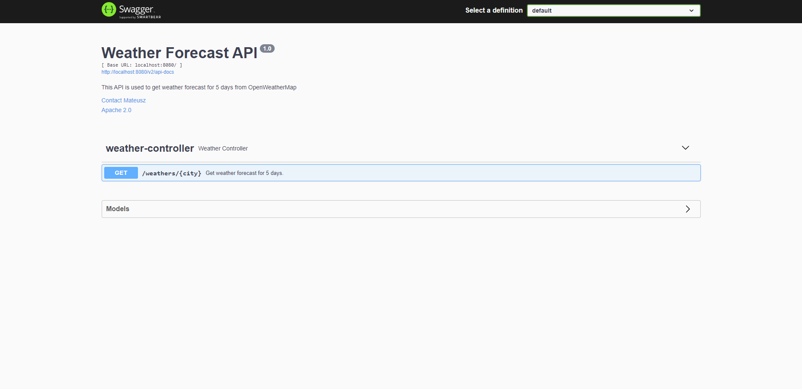
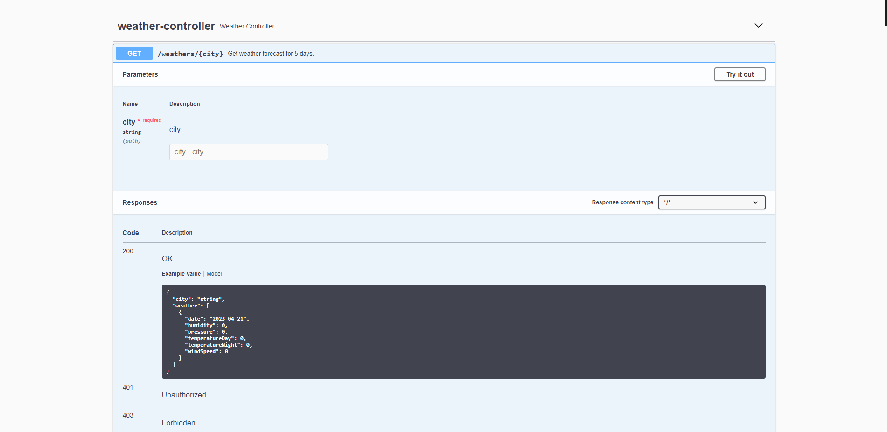
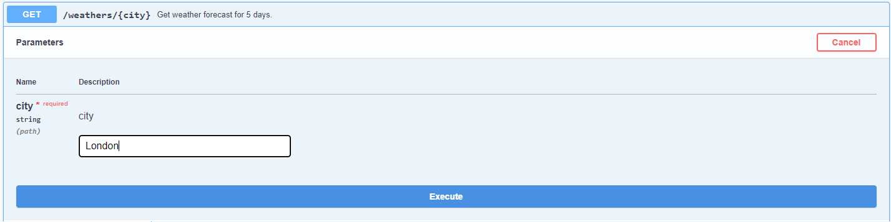
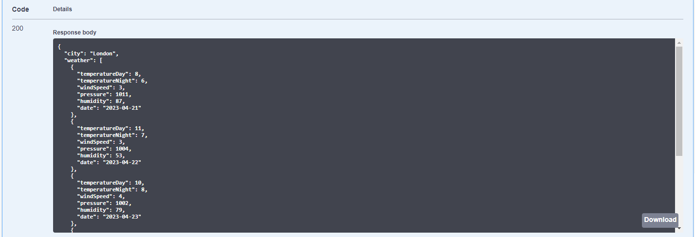

# Weather Forecast API
<h3>PL</h3>
<b>Weather Forecast to aplikacja napisana w języku Java z wykorzystaniem technologii Spring,
JUnit, Mockito oraz Docker. Umożliwia użytkownikowi podanie nazwy dowolnego miasta, a
następnie zwraca prognozę pogody na 5 dni, korzystając z zewnętrznego API
OpenWeatherMap. Aplikacja komunikuje się z API za pomocą protokołu REST, a testy
jednostkowe są wykonywane przy użyciu bibliotek JUnit i Mockito.
Dzięki zastosowaniu Docker, aplikacja jest łatwa w wdrożeniu i skalowaniu.</b>

<b>Technologie:
- Java
- Spring
- JUnit
- Mockito
- Docker
- REST
  </b>

<h3>ENG</h3>
<b>Weather Forecast is a Java application developed using Spring, JUnit,
Mockito, and Docker. It allows the user to enter the name of any city and receive
a 5-day weather forecast, utilizing the external OpenWeatherMap API.
The application communicates with the API using the REST protocol,
and unit tests are conducted using the JUnit and Mockito libraries.
Thanks to Docker, the application is easy to deploy and scale.</b>

<b>Technology:
- Java
- Spring
- JUnit
- Mockito
- Docker
- REST
</b>

<br></br>
<b>Swagger:</b>
```
/swagger-ui/index.html#
```
<br></br>
<b>Exchanges:</b>

|   Method   |       Url        |           Descritpion            |
|:----------:|:----------------:|:--------------------------------:|
| <b>GET</b> | /weathers/{city} | get weather forecast for 5 days. |

<br></br>
<b>example request:</b>
```
{
  "city": London
}
```
<br></br>
<b>response:</b>
```
{
  "city": "London",
  "weather": [
    {
      "temperatureDay": 8,
      "temperatureNight": 6,
      "windSpeed": 3,
      "pressure": 1011,
      "humidity": 87,
      "date": "2023-04-21"
    },
    {
      "temperatureDay": 11,
      "temperatureNight": 7,
      "windSpeed": 3,
      "pressure": 1004,
      "humidity": 53,
      "date": "2023-04-22"
    },
    {
      "temperatureDay": 10,
      "temperatureNight": 8,
      "windSpeed": 4,
      "pressure": 1002,
      "humidity": 79,
      "date": "2023-04-23"
    },
    {
      "temperatureDay": 9,
      "temperatureNight": 7,
      "windSpeed": 3,
      "pressure": 1013,
      "humidity": 58,
      "date": "2023-04-24"
    },
    {
      "temperatureDay": 10,
      "temperatureNight": 6,
      "windSpeed": 3,
      "pressure": 1019,
      "humidity": 41,
      "date": "2023-04-25"
    }
  ]
}
```

<br></br>
<b>Images:</b>








